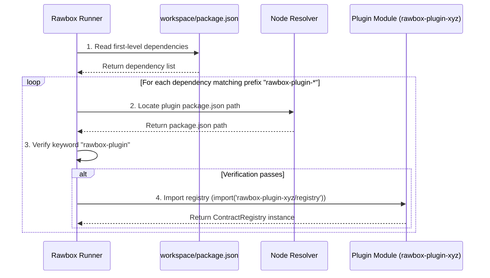

# rawbox-plugin

## 1. Goal

This library allows the creation of Definitions for components (operation or control-flow).

These Definitions contents all the necessary information in order to load and execute these components.

A complete Definition consists of:

1.1. **Contract**: The interface or schema (e.g., `inputSchema`, `outputSchema`, `errorSchema`) defined using `typebox`.
1.2. **Handler**: The raw business-logic implementation of the component.
1.3. **ValidatedHandler**: A type-validated implementation wrapper that enforces the `typebox` schemas at runtime before and after executing the handler.

---

## 2. Workflow: Adding an Operation Type Component

### 2.1. Add an Operation Contract Registry

Define all your specific operation contracts in a registry. This explicitly states the IO structures of your plugins.

```typescript
// packages/rawbox-plugin-example/src/contract-registry.ts
import { Type } from 'typebox';
import {
  setupOperationContractRegistry,
  getOperationDefinitionBuilder,
} from 'rawbox-plugin';

const ContractRegistry = setupOperationContractRegistry({
  contractRecord: {
    './sum.definition.js': {
      type: 'operation',
      description: 'Sum two numbers',
      inputSchema: Type.Object({
        a: Type.Number(),
        b: Type.Number(),
      }),
      outputSchema: Type.Object({
        value: Type.Number(),
      }),
      errorSchema: Type.Object({
        message: Type.String(),
      }),
      version: '1.0.0',
    },
  },
});

// Export a typed creator bound to your specific registry
export const createOperationDefinition =
  getOperationDefinitionBuilder(ContractRegistry);
export default ContractRegistry;
```

### 2.2. Add the Operation Definition (The Implementation)

Write the actual logic/handler using the creator bound to your registry. Because of the registry's generic inference, your inputs and outputs are typed.

```typescript
// packages/rawbox-plugin-example/src/sum.definition.ts
import { ok } from 'neverthrow';
import { createOperationDefinition } from './contract-registry.js';

const operationDefinition = createOperationDefinition(
  './sum.definition.js',
  async (input) => {
    // `input` is typed
    const { a, b } = input;

    // The return type is checked against outputSchema
    return ok({ value: a + b });
  },
);

export default operationDefinition;
```

---

## 3. Workflow: Adding a Control-Flow Type Component

Adding a control-flow component follows the exact same pattern but uses the control-flow specific registry and builders.

### 3.1. Add a Control-Flow Contract Registry

```typescript
// packages/rawbox-plugin-example/src/contract-registry.ts
import { Type } from 'typebox';
import {
  getControlFlowDefinitionBuilder,
  setupControlFlowContractRegistry,
} from 'rawbox-plugin';

const ContractRegistry = setupControlFlowContractRegistry({
  contractRecord: {
    './goto.definition.js': {
      type: 'control-flow',
      description: 'Jump to a specific step',
      inputSchema: Type.Object({
        condition: Type.Boolean(),
        label: Type.String(),
      }),
      errorSchema: Type.Object({
        message: Type.String(),
      }),
      version: '1.0.0',
    },
  },
});

export const createControlFlowDefinition =
  getControlFlowDefinitionBuilder(ContractRegistry);

export default ContractRegistry;
```

### 3.2. Add the Control-Flow Definition

The control-flow handler always expects to return an object matching `{ label: string }`.

```typescript
// packages/rawbox-plugin-example/src/goto.definition.ts
import { ok } from 'neverthrow';
import { createControlFlowDefinition } from './contract-registry.js';

const controlFlowDefinition = createControlFlowDefinition(
  './goto.definition.js',
  async (input) => {
    // `input` is typed
    const { label } = input;

    // Control-Flow handlers must return a label
    return ok({ label });
  },
);

export default controlFlowDefinition;
```

With this architecture, the Runner can trust that any `Definition` it receives matches its schema, eliminating runtime data anomalies.

> [!TIP]
> When a plugin exposes **both** operations and control-flows, use the
> `setupPluginRegistry({ operationsRecord, controlFlowRecord })` convenience from
> `rawbox-plugin` instead of the two separate registries above. It merges both
> records into a single hashed contract registry and returns
> `createOperationDefinition` and `createControlFlowDefinition` builders — this is
> how [rawbox-plugin-default](../rawbox-plugin-default/src/contract-registry.ts)
> is built.

---

## 4. Building Rawbox Plugins

A Rawbox plugin is a modular, content-addressable package that exposes **Operation** or **Control-Flow** definitions. To build and package a custom plugin, it must satisfy:
1. **Naming**: Named with the prefix `rawbox-plugin-*` (e.g., `rawbox-plugin-example`).
2. **Keywords**: Must contain the keyword `"rawbox-plugin"` in its `package.json`.
3. **Registry Export**: Must expose its contract registry via the standard subpath export `./contract-registry`.

### Scaffolding a Plugin

You can scaffold a new plugin non-interactively using the CLI:
```bash
npx rawbox-cli plugin create --name rawbox-plugin-example --no-install
```
Or interactively by running:
```bash
npx rawbox-cli plugin create
```

### Plugin Directory Structure

The tool scaffolds the following layout:
```text
rawbox-plugin-example/
├── package.json          # Package configuration & subpath exports
├── tsconfig.json         # TypeScript configuration targeting dist/
├── src/
│   ├── contract-registry.ts    # Contract definitions & registration
│   ├── operations/
│   │   └── hello-world.definition.ts  # Hello-world handler definition
│   └── index.ts
└── tests/
    └── hello-world.test.ts     # Vitest unit test suite
```

#### A. `package.json`
Specifies package metadata and standard ESM exports:
- **`exports`**: Exposes the compiled registry via `"./contract-registry": "./dist/contract-registry.js"`.
- **`dependencies`**: Includes `typebox`, `neverthrow`, and `rawbox-plugin`.

#### B. `tsconfig.json`
Configures compiled module outputs, targeting the `dist/` distribution folder.

#### C. `contract-registry.ts`
Registers all contract schemas in the plugin. Operations and control-flows must be defined and setup here:
```typescript
import { Type } from 'typebox';
import { setupContractRegistry } from 'rawbox-plugin/core';
import { getOperationDefinitionBuilder } from 'rawbox-plugin/operation';

const operationsRecord = {
  './operations/hello-world.definition.js': {
    type: 'operation',
    description: 'A hello world operation example',
    inputSchema: Type.Object({ name: Type.String() }),
    outputSchema: Type.Object({ greeting: Type.String() }),
    errorSchema: Type.Object({ message: Type.String() }),
    version: '1.0.0',
  },
} as const;

export const contractRegistry = setupContractRegistry({
  contractRecord: { ...operationsRecord },
});

export const createOperationDefinition = getOperationDefinitionBuilder({
  ...contractRegistry,
  contractRecord: operationsRecord,
});
```

---

## 5. Plugin Discovery Architecture

This section details the v2 discovery mechanism used by the Rawbox runner to locate, verify, and dynamically import plugin registries. This architecture ensures low startup latency and standard Node.js module resolution.

### Runner Resolution Flow

The Rawbox runner inspects the workspace's local `package.json` dependencies, resolves paths natively, and dynamically imports each plugin registry.



### Implementation Reference
The discovery algorithm is implemented inside the runner using native Node.js APIs for maximum speed:

```javascript
import fs from 'node:fs';
import path from 'node:path';
import { createRequire } from 'node:module';

export async function discoverPlugins(workspacePath) {
  const require = createRequire(import.meta.url);
  const pjsonPath = path.join(workspacePath, 'package.json');
  const pjson = JSON.parse(fs.readFileSync(pjsonPath, 'utf8'));

  const dependencies = Object.keys({
    ...pjson.dependencies,
    ...pjson.devDependencies,
  });

  const registries = [];

  for (const dep of dependencies) {
    if (dep.startsWith('rawbox-plugin-')) {
      try {
        // Resolve package.json location
        const depPjsonPath = require.resolve(`${dep}/package.json`, {
          paths: [workspacePath],
        });
        const depPjson = JSON.parse(fs.readFileSync(depPjsonPath, 'utf8'));

        // Verify keyword match
        if (depPjson.keywords && depPjson.keywords.includes('rawbox-plugin')) {
          // Import registry from subpath export ./contract-registry
          const module = await import(`${dep}/contract-registry`);
          registries.push(module.default);
        }
      } catch (error) {
        console.error(
          `Failed to load plugin registry for ${dep}:`,
          error.message,
        );
      }
    }
  }

  return registries;
}
```

### Registry Cache Hashing

To ensure registry integrity, enable tamper-proofing, and support absolute versioning, the loaded registries are saved in a cache keyed by the **SHA-256 content-hash** of the JSON-serialized `contractRecord`.

#### Hashing Strategy
We use standard Node.js crypto hashing of the JSON-serialized contract schema:
- **Method**: `crypto.createHash('sha256').update(JSON.stringify(contractRecord)).digest('hex')`
- **Verification**: Deterministic hashing provides a secure signature representing the registry's contract schema.
