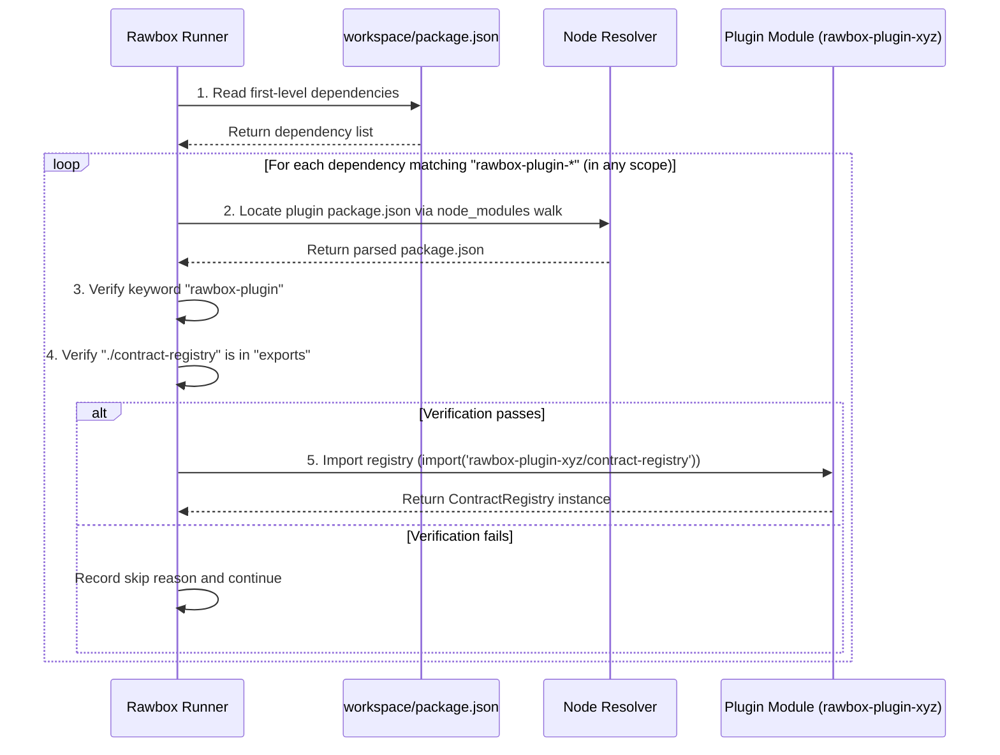

# rawbox-plugin

## 1. Goal

This library allows the creation of Definitions for components (operation or control-flow).

These Definitions contain all the information needed to load and execute a component.

A complete Definition consists of:

1.1. **Contract**: The interface or schema (e.g., `inputSchema`, `outputSchema`, `errorSchema`) defined using `typebox`.
1.2. **Handler**: The raw business-logic implementation of the component.
1.3. **ValidatedHandler**: A type-validated wrapper that enforces the `typebox` schemas at runtime, before and after executing the handler.

### Entry Points

| Import | Contents |
| --- | --- |
| `@rawbox/plugin` | The plugin-author surface: `setupPluginRegistry`, `setupOperationContractRegistry`, `getOperationDefinitionBuilder`, `setupControlFlowContractRegistry`, `getControlFlowDefinitionBuilder`. |
| `@rawbox/plugin/core` | Shared primitives and the runner-side loading surface: `setupContractRegistry`, `DefinitionLocation`, `ContractRegistryCache`, `ContractRegistryLoader`, `loadDefinition`, `definitionGuard`, and the `Contract` / `Definition` types. |
| `@rawbox/plugin/operation` | Operation contracts, builders, and `OperationDefinitionCache`. |
| `@rawbox/plugin/control-flow` | Control-flow contracts, builders, `ReservedLabel`, and `ControlFlowDefinitionCache`. |

> [!TIP]
> Most plugins only need `setupPluginRegistry` from the package root — it covers both
> component types in one call. §2 and §3 show the single-type registries it is built from,
> which is the clearest way to see what each half does.

---

## 2. Workflow: Adding an Operation Type Component

### 2.1. Add an Operation Contract Registry

Define all your specific operation contracts in a registry. This explicitly states the IO structures of your plugins.

```typescript
// packages/rawbox-plugin-example/src/contract-registry.ts
import { Type } from '@rawbox/plugin/typebox';
import {
  setupOperationContractRegistry,
  getOperationDefinitionBuilder,
} from '@rawbox/plugin';

const ContractRegistry = setupOperationContractRegistry({
  contractRecord: {
    './sum.definition.js': {
      type: 'operation',
      description: 'Sum two numbers',
      inputSchema: Type.Object({
        a: Type.Number(),
        b: Type.Number(),
      }),
      outputSchema: Type.Object({
        value: Type.Number(),
      }),
      errorSchema: Type.Object({
        message: Type.String(),
      }),
      version: '1.0.0',
    },
  },
});

// Export a typed creator bound to your specific registry
export const createOperationDefinition =
  getOperationDefinitionBuilder(ContractRegistry);
export default ContractRegistry;
```

### 2.2. Add the Operation Definition (The Implementation)

Write the actual logic/handler using the creator bound to your registry. Because of the registry's generic inference, your inputs and outputs are typed.

```typescript
// packages/rawbox-plugin-example/src/sum.definition.ts
import { ok } from '@rawbox/plugin/neverthrow';
import { createOperationDefinition } from './contract-registry.js';

const operationDefinition = createOperationDefinition(
  './sum.definition.js',
  async (input) => {
    // `input` is typed
    const { a, b } = input;

    // The return type is checked against outputSchema
    return ok({ value: a + b });
  },
);

export default operationDefinition;
```

A workflow reaches this operation by naming the package and the **operation path** — the
key above without its `./` prefix and `.definition.js` suffix:

```yaml
steps:
  - label: sum-step
    plugin: "@acme/rawbox-plugin-example"
    operation: sum
```

---

## 3. Workflow: Adding a Control-Flow Type Component

Adding a control-flow component follows the exact same pattern but uses the control-flow specific registry and builders.

### 3.1. Add a Control-Flow Contract Registry

```typescript
// packages/rawbox-plugin-example/src/contract-registry.ts
import { Type } from '@rawbox/plugin/typebox';
import {
  getControlFlowDefinitionBuilder,
  setupControlFlowContractRegistry,
} from '@rawbox/plugin';

const ContractRegistry = setupControlFlowContractRegistry({
  contractRecord: {
    './goto.definition.js': {
      type: 'control-flow',
      description: 'Jump to a specific step',
      inputSchema: Type.Object({
        condition: Type.Boolean(),
        label: Type.String(),
      }),
      errorSchema: Type.Object({
        message: Type.String(),
      }),
      version: '1.0.0',
    },
  },
});

export const createControlFlowDefinition =
  getControlFlowDefinitionBuilder(ContractRegistry);

export default ContractRegistry;
```

Note there is no `outputSchema`: the framework fixes a control-flow's output to
`{ label: string, reason?: string }`. That is why a control-flow step may not declare
`outputs:` in a workflow, and why such a component can never mutate storage — neither
field is ever written to a box; both are read by the runner.

### 3.2. Add the Control-Flow Definition

The control-flow handler always returns an object matching
`{ label: string, reason?: string }`.

```typescript
// packages/rawbox-plugin-example/src/goto.definition.ts
import { ok } from '@rawbox/plugin/neverthrow';
import { createControlFlowDefinition } from './contract-registry.js';

const controlFlowDefinition = createControlFlowDefinition(
  './goto.definition.js',
  async (input) => {
    // `input` is typed
    const { label } = input;

    // Control-Flow handlers must return a label
    return ok({ label });
  },
);

export default controlFlowDefinition;
```

The returned label may be another step's `label` or one of the reserved labels exported as
`ReservedLabel`: `__START__` (first step), `__END__` (last step), `__EXIT__` (terminate),
`__FAIL__` (terminate as a failure). A handler returning `__FAIL__` MAY return a `reason`
beside it — the framework's fixed output schema is `{ label, reason? }` — which the runner
uses as the run's error message. That is the only way a definition can end a run as a
failure by choice: returning `err(...)` reports a *handled* step failure, after which the
workflow continues.

With this architecture, the Runner can trust that any `Definition` it receives matches its schema, eliminating runtime data anomalies.

---

## 4. Building Rawbox Plugins

A Rawbox plugin is a modular, content-addressable package exposing **Operation** or
**Control-Flow** definitions. A workflow can reach any package it declares under
`plugins:`, but to be **auto-discovered** a package must satisfy all three of:

1. **Naming**: The `rawbox-plugin-*` prefix (e.g. `rawbox-plugin-example`), optionally inside any scope (e.g. `@acme/rawbox-plugin-example`).
2. **Keywords**: The keyword `"rawbox-plugin"` in its `package.json`.
3. **Registry Export**: The contract registry exposed via the subpath export `./contract-registry`, with the registry as the module's `default` export.

All three are enforced at discovery time. A candidate matching the name convention but failing (2) or (3) is skipped with a reported reason, never dropped silently.

### Scaffolding a Plugin

```bash
npx rawbox-cli plugin create --name rawbox-plugin-example --no-install
```
Or interactively:
```bash
npx rawbox-cli plugin create
```

### Plugin Directory Structure

The tool scaffolds the following layout:
```text
rawbox-plugin-example/
├── package.json                        # Package configuration & subpath exports
├── tsconfig.json                       # TypeScript configuration targeting dist/
├── src/
│   ├── contract-registry.ts            # Contract definitions & registration
│   └── operations/
│       └── hello-world.definition.ts   # Hello-world handler definition
└── tests/
    └── hello-world.test.ts             # Vitest unit test suite
```

#### A. `package.json`
- **`keywords`**: Includes `"rawbox-plugin"`, the discovery opt-in.
- **`exports`**: Exposes the compiled registry via `"./contract-registry": "./dist/contract-registry.js"`.
- **`dependencies`**: none. A scaffolded plugin declares no runtime dependency at all — `typebox` and `neverthrow` both arrive through `@rawbox/plugin`'s passthrough subpaths (see below). A plugin wrapping a third-party library of its own is of course free to declare that.
- **`peerDependencies`**: `@rawbox/plugin` — the host supplies it, so a plugin never bundles a second copy of the definition machinery. It is also a devDependency so the package builds and tests standalone.

### The passthrough subpaths: `@rawbox/plugin/typebox` and `@rawbox/plugin/neverthrow`

`@rawbox/plugin` re-exports both libraries unchanged, so a plugin imports them from the one
package it already depends on:

```typescript
import { Type } from '@rawbox/plugin/typebox';
import { ok, err } from '@rawbox/plugin/neverthrow';
```

Neither adds or wraps anything — `export * from '…'` and nothing else. The point is that a
plugin then declares **no dependencies of its own**, so there is no second version to keep in
range, no floor to bump when the framework moves, and one copy of each library in the tree by
construction. Both are ordinary `dependencies` of `@rawbox/plugin`, which is what makes the
re-export resolve in a consumer's install rather than only inside this monorepo.

Only the libraries' *root* exports are passed through. `typebox/compile` and `typebox/error`
are not mirrored, because no plugin has needed them; when one does, the answer is another
subpath here rather than a `typebox` dependency in the plugin.

This is an ergonomic guarantee, not a structural one. A plugin may still declare its own
`typebox` at any version, and everything below explains why that is safe.

### Why a plugin's `typebox` version does not have to match the framework's

It used to have to. Here's what changed, and why the old failure is worth still being able to
find.

**The old trap.** Every contract-bearing type this package exports (`OperationContract`,
`ControlFlowContract`, and everything `setupPluginRegistry` infers from them) used to be
generic directly over TypeBox's `TObject`, which includes a *computed* field:
`required: TRequiredArray<Properties>`, a tuple type TypeScript evaluates fresh per installed
copy of `typebox`. When a plugin's `typebox` and `@rawbox/plugin`'s `typebox` were different
installed copies — which npm's dedupe cannot always prevent; an isolated `node_modules` tree,
as `workspace setup` produces (see [@rawbox/runner](../rawbox-runner/README.md)), is its own
resolution root — TypeScript fell back to comparing that computed tuple structurally and
refused to unify it. The failure was genuinely confusing: it did **not** say "typebox version
mismatch". It said something like:

```
Type 'undefined' is not assignable to type '[string]'.
```

for a schema with zero required properties, or `Type '["a", "b"]' is not assignable to type
'[string]'.` for a schema with two. Both read like a rule limiting a contract schema to at most
one required property — no such rule ever existed. **If you're seeing this error on an older
`@rawbox/plugin`, this is that bug — upgrade and it goes away; nothing about your schema is
wrong.**

**The fix.** `@rawbox/plugin`'s generics now constrain on a local structural interface instead
of on `TObject` itself:

```typescript
export interface ObjectSchemaLike {
  readonly '~kind': 'Object';
  readonly type: 'object';
  readonly properties: Record<string, unknown>;
}
```

This names the fields the SDK actually reads and, deliberately, omits `required` — the
computed field that caused the mismatch. Two different `typebox` copies now unify without
issue because there is nothing computed left for TypeScript to disagree about. `typebox`'s own
`Static<>`, which does the real work of turning a schema into a TypeScript type, was never
part of the problem: its constraint is the empty `interface TSchema {}`, and it dispatches
structurally on the `'~kind'` string literal, so it already worked fine across copies. Type
inference for handler inputs/outputs is fully preserved by this change, including optional,
nested, array, and union properties.

> A consequence worth stating plainly: a plugin's `typebox` version no longer has to match the
> framework's, and a plugin can go further still — authoring `inputSchema` / `outputSchema` /
> `errorSchema` as plain hand-written JSON Schema objects, with no `typebox` dependency at all.
> Inference works the same way as long as the object is well-formed; a malformed one degrades
> to `unknown`, which then fails wherever the handler tries to use it, so the mistake doesn't
> go silent. Runtime was never affected by any of this either way — a compiled `typebox` schema
> is a plain JSON-serializable object with no symbols attached, so any copy's `Compile()` can
> validate a schema built by any other copy, or by none at all.

For anyone extending `@rawbox/plugin` itself, the design rule that keeps this fixed is: the
SDK's generic constraints may **name** a schema field but must never **compute** one. A
conditional or mapped type written over the type parameter — even one that looks unrelated to
`required` — would reintroduce the same cross-copy mismatch.

### Diagnosing a version mismatch

`npx rawbox-cli plugin info <workflow file>` still resolves every declared plugin from the
workspace's own install and, alongside the usual status and lock report, reports that plugin's
resolved `typebox` version next to the framework's. Since the two no longer have to agree for
correctness, this is neutral context, not a diagnosis: it states the two resolved versions and
stops there — it does not prescribe pinning one to the other.

A plugin importing from `@rawbox/plugin/typebox` has no `typebox` of its own to resolve, so
this report simply has nothing to say about it. That silence is the expected result for a
plugin scaffolded by the current CLI, not a failure to detect something.

This check runs wherever a plugin's contract registry is resolved (`packages/rawbox-runner/src/workflow/plugin-registry-loader.ts`), so `plugin info` reports it for a package that
already resolves and imports cleanly, not only when something else has already failed.

#### B. `tsconfig.json`
Configures compiled module outputs, targeting the `dist/` distribution folder.

#### C. `contract-registry.ts`
Registers every contract in the plugin. `setupPluginRegistry` merges the two records into a
single hashed registry and returns a typed builder for each half:

```typescript
import { Type } from '@rawbox/plugin/typebox';
import { setupPluginRegistry } from '@rawbox/plugin';

const operationsRecord = {
  './operations/hello-world.definition.js': {
    type: 'operation',
    description: 'A hello world operation example',
    inputSchema: Type.Object({ name: Type.String() }),
    outputSchema: Type.Object({ greeting: Type.String() }),
    errorSchema: Type.Object({ message: Type.String() }),
    version: '1.0.0',
  },
} as const;

const controlFlowRecord = {} as const;

export const {
  contractRegistry,
  createOperationDefinition,
  createControlFlowDefinition,
} = setupPluginRegistry({
  operationsRecord,
  controlFlowRecord,
});

export default contractRegistry;
```

The `as const` matters: it is what lets the builders infer each definition's input and
output types from its contract.

#### D. Declaring a bound — `timeoutMs`

A contract may declare how long the host should let its handler run before the run is
abandoned. It is an optional whole number of **milliseconds**, from `1` to `2147483647`
(exported as `TIMEOUT_MS_MAX`), and it goes **last in the contract literal, after
`version`**:

```typescript
'./market/subscribe.definition.js': {
  type: 'operation',
  description: 'Waits for the next tick on the venue websocket',
  inputSchema: Type.Object({ symbol: Type.String() }),
  outputSchema: Type.Object({ price: Type.Number() }),
  errorSchema: Type.Object({ message: Type.String() }),
  version: '1.0.0',
  timeoutMs: 30_000,
},
```

The position is a convention rather than a rule, and it is worth keeping for two
reasons: the schemas are what a reader opens a contract to find, and an
execution-policy field wedged between them displaces them — and moving a field
within a contract literal changes the registry's SHA-256 hash, since `computeHash`
sorts the definition-path keys and only those.

**When to declare one, and when to leave it out.** Omitting the key is not a gap in the
contract — it declares the component *deliberately unbounded*, and for most components
that is the correct declaration. There is no default and no fallback bound.

| Declare a bound | Omit it |
| --- | --- |
| The handler awaits something a **third party** controls: a socket, an HTTP response, a lock, a queue that may never be fed. | The handler is **synchronous**, or awaits only itself. A timer is a task on the same event loop, so a handler that never yields never lets it fire — a bound there is not a weak guarantee, it is none. |
| The right ceiling is a property of the **component**, not of any one workflow using it. | The wait duration **is its own input** (`time/sleep`'s `ms`), where a second number in the contract is only free to contradict the first. |
| Exceeding it means something is **wrong**, not merely slow. | The right number depends on values a **document** seeds, which no plugin author can see. Let the workflow declare it. |

Everything `@rawbox/rawbox-plugin-default` ships lands in the right-hand column; see
[that package's README](../rawbox-plugin-default/README.md) for why its correct diff was
an empty one.

**A workflow overrides, it does not merely tighten.** A step's own `timeoutMs:` replaces
the contract's outright — `step.timeoutMs ?? contract.timeoutMs ?? unbounded` — so a
document may loosen a bound as well as tighten it, and may remove it entirely by writing
`timeoutMs: unbounded`. Declaring a bound is therefore advice with teeth rather than a
guarantee the plugin gets to enforce, and that is deliberate: an operation that blocks
until the next message arrives is frequently the workflow's own pacing mechanism.

`setupContractRegistry` — which every registry construction funnels through, including
`setupPluginRegistry` and the two single-type registries above — rejects anything else at
**module-evaluation** time, naming the definition path. In particular `0` is rejected
rather than read as "no bound": it reads that way in the C tradition, but `setTimeout`
fires it on the next tick, and it is exactly what a computed bound lands on when the
arithmetic goes wrong. There is no "no bound" *value*; absence is the declaration.

Adding a bound to a shipped contract changes the registry hash, so a workspace with a
`rawbox.lock` must be re-locked — see §5. Adding the *field* to the SDK changed nothing:
a contract that does not declare one serialises exactly as it always did.

---

## 5. Plugin Discovery Architecture

This section details how the Rawbox runner locates, verifies, and dynamically imports plugin
registries. The algorithm is implemented by `PluginDiscoverer` and
`loadPluginContractRegistry` in [@rawbox/runner](../rawbox-runner/README.md); the flow below
is the contract those satisfy.

### Runner Resolution Flow


```mermaid
sequenceDiagram
    participant Runner as Rawbox Runner
    participant PJSON as workspace/package.json
    participant Resolver as Node Resolver
    participant Plugin as Plugin Module (rawbox-plugin-xyz)

    Runner->>PJSON: 1. Read first-level dependencies
    PJSON-->>Runner: Return dependency list

    loop For each dependency matching "rawbox-plugin-*" (in any scope)
        Runner->>Resolver: 2. Locate plugin package.json via node_modules walk
        Resolver-->>Runner: Return parsed package.json
        Runner->>Runner: 3. Verify keyword "rawbox-plugin"
        Runner->>Runner: 4. Verify "./contract-registry" is in "exports"
        alt Verification passes
            Runner->>Plugin: 5. Import registry (import('rawbox-plugin-xyz/contract-registry'))
            Plugin-->>Runner: Return ContractRegistry instance
        else Verification fails
            Runner->>Runner: Record skip reason and continue
        end
    end
```

Two details are load-bearing:

* **The `node_modules` walk in step 2 is not an optimization.** `require.resolve('<dep>/package.json')` cannot be used: Node's `exports` encapsulation blocks deep imports a package's `exports` map does not list, and every Rawbox plugin declares `exports`. Walking up from the workspace directory also handles hoisting.
* **Steps 3 and 4 run before the import.** The keyword is the opt-in, and checking the subpath first means a missing export is reported as a skip reason rather than as an opaque module-resolution failure.

Resolution starts from the workspace's target folder (see `resolveTargetFolder`), then the
workspace directory, then the process cwd — which is what makes `workspace setup` and
`workflow run` agree on where a plugin lives.

### Registry Cache Hashing

To ensure registry integrity, enable tamper-proofing, and support absolute versioning, loaded
registries are cached under the **SHA-256 content-hash** of the JSON-serialized
`contractRecord`:

- **Method**: `crypto.createHash('sha256').update(JSON.stringify(contractRecord)).digest('hex')`
- **Addressing**: A resolved step addresses a component by the pair `(contractRegistryHash, definitionPath)` — the `DefinitionLocation` exported from `@rawbox/plugin/core`.
- **Authoring**: Workflows never write that hash. They name the package, and the resolver supplies the hash; `rawbox.lock` pins what it resolved to.

Print a registry's hash with:

```bash
npx rawbox-cli registry hash ./packages/rawbox-plugin-example/dist/contract-registry.js
```

---

## 6. The Run-Event Channel

A handler's signature is `(input) => Result<…>` and nothing more — it receives no
run context, no logger, no span. `@rawbox/plugin`'s **run-event channel** is the one
seam a definition has for handing a structured event to whatever is executing it
anyway, without that signature growing a parameter:

```typescript
import { emitRunEvent } from '@rawbox/plugin';

const routed = emitRunEvent({ event: 'log', level: 'info', message: 'checkpoint reached' });
// `routed` is `false` with no host installed — see the fallback note below.
```

`emitRunEvent` hands the payload to whatever `RunEventChannel` the host installed via
`setRunEventChannel` (`@rawbox/plugin/core`) — an **ambient, process-wide slot**
addressed by a `Symbol.for` key, not a module-level variable, because a plugin
resolved into a workspace's own `.rawbox/node_modules` is frequently a *different
copy* of this package than the one the host imported, and only a cross-realm symbol
registry guarantees both land on the same slot. `@rawbox/runner`'s
`runWorkflowInstance` installs the channel for the duration of a run and removes it
afterwards (see [@rawbox/runner](../rawbox-runner/README.md) §4.2); a host recognises
**the event kind it owns**, never which plugin sent it, and drops any kind it does
not. With no channel installed — a unit test, a different embedder — `emitRunEvent`
returns `false` rather than throwing, which is the signal a definition uses to fall
back to its own standalone behaviour (`observability/log` in
`@rawbox/rawbox-plugin-default` falls back to `console.<level>`, for instance) so a
line is never simply lost.

**`step.progress`** is the second event kind the runner recognises through this same
channel, alongside `log` (see [@rawbox/runner](../rawbox-runner/README.md#44-stepprogress--opt-in-mid-step-progress)
§4.4): it is opt-in
mid-step progress for an operation with real work to report partway through a long
step, e.g. a batch import that wants to say "4200 of 10000 rows processed" without
waiting for the step to finish. Call it exactly like `log`, just with no `level`:
`emitRunEvent({ event: 'step.progress', message: 'processed 4200 of 10000 rows',
data: { processed: 4200, total: 10000 } })` — the runner-side channel host validates
and stamps it the same way it does `log` (a non-string `message` is dropped, an
absent one is fine since a progress line may carry only `data`), attaches the
envelope and the current step's correlation, and routes it into the same NDJSON
file, terminal render, and OTel span the rest of the stream uses — no side channel,
no new host API to learn.
