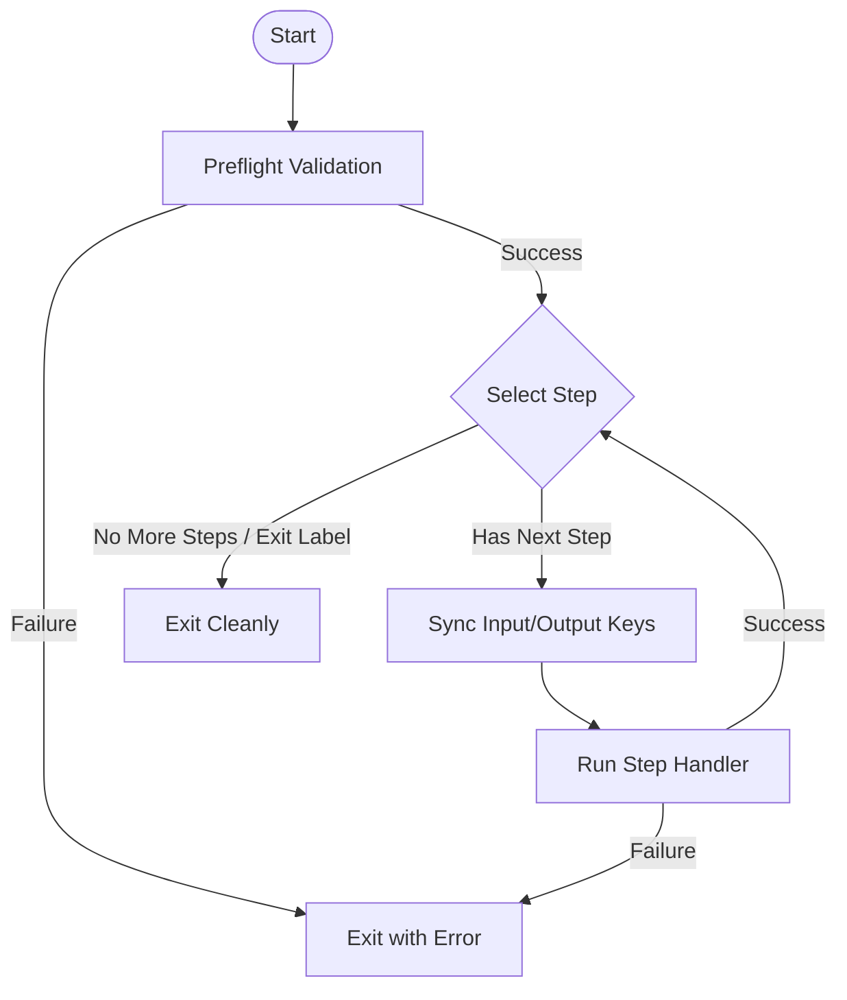

# rawbox-runner

`rawbox-runner` is the core orchestration and execution engine of the Rawbox Framework. Powered by **XState v5**, it compiles, verifies, and runs declarative workflows as robust state machines. It integrates seamlessly with `rawbox-store` to read step inputs and persist outputs/errors in an LMDB-backed database under strict storage boundary rules.

---

## Features

- ⚙️ **State-Machine Orchestration**: Built on XState v5 for predictable, debuggable state transitions.
- 🔒 **Storage Boundaries**: Enforces strict read/write sandboxing for workflow inputs, outputs, and error handling.
- 🔍 **Preflight Verification**: Validates workflows against TypeBox schemas and ensures plugin registries are loaded before execution.
- 🚀 **Result-Oriented (Neverthrow)**: Replaced throwing actors with functional `Result<T, Error>` wrappers to prevent unhandled crashes.

---

## Architectural Workflow

The execution of a workflow follows a structured sequence of states inside the XState runner:



---

## Orchestration Steps

1. **Preflight**: Validates the workflow schema and imports all plugin contract registries.
2. **Select Step**: Determines the next step to execute based on the workflow's step list or control-flow jumps.
3. **Sync DB**: Resolves data mapping from LMDB storage for step inputs.
4. **Run Step**: Dynamically loads the corresponding plugin handler and executes it.
5. **Exit**: Persists terminal logs and tears down resources.

---

## 1. Workspace Configuration

Workspaces define the boundaries of your workflows and plugins. Create a `workspace.yaml` file at your workspace root:

```yaml
name: data-processing-workspace
workflowPathList:
  - ./workflows/throttle-ops.yaml
```

---

## 2. Workflow Definition

Workflows are declarative YAML files detailing the sequence of steps, definition hashes, and storage key mappings.

```yaml
name: throttle-ops
pluginPathList:
  - ../packages/rawbox-plugin-default
stepList:
  - label: throttle-step
    definitionLocation:
      contractRegistryHash: "92837f61c312..."
      definitionPath: ./time/workflow-throttle.definition.js
    storageLocation:
      input:
        ms:
          key: throttle_ms
          strategy:
            name: lmdb-kv
            valueSizeMax: 2022
      output:
        throttledMs:
          key: throttle_result_throttled_ms
          strategy:
            name: lmdb-kv
            valueSizeMax: 2022
        timestamp:
          key: throttle_result_timestamp
          strategy:
            name: lmdb-kv
            valueSizeMax: 2022
      error:
        message:
          key: throttle_error_message
          strategy:
            name: lmdb-kv
            valueSizeMax: 2022
```

Control-flow steps decide the next step by returning a label: a step's `label`, or one
of the reserved labels `__START__` (first step), `__END__` (last step), `__EXIT__`
(terminate). See the built-in control-flows in
[rawbox-plugin-default](../rawbox-plugin-default/README.md).

---

## 3. Programmatic Validation API

You can import core validation logic directly into your Node/TypeScript application:

```typescript
import { validateWorkflowType, validateStorageBoundaries } from 'rawbox-runner';

// 1. Schema Validation (Typebox)
const typeResult = validateWorkflowType(workflowJson);
if (typeResult.isErr()) {
  console.error("Invalid workflow schema:", typeResult.error.message);
}

// 2. Storage Boundaries Verification
// Verifies cross-workflow boundaries (structurally enforced by JSON schemas, remaining as a preflight hook).
const boundaryResult = validateStorageBoundaries(workflowJson, "data-processing-workspace");
if (boundaryResult.isErr()) {
  console.error("Storage boundary violation:", boundaryResult.error.message);
}
```
